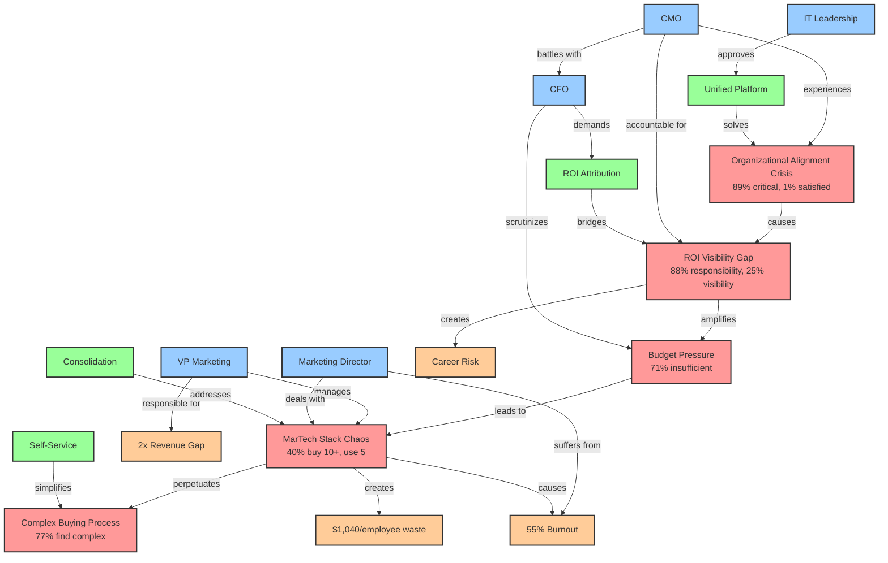

# Knowledge Graph: Enterprise Marketing Leaders Pain Points

## Visual Representation

## Entity Relationship Summary

### Pain Point Cascade
1. **Organizational Alignment Crisis** → 
2. **ROI Visibility Gap** → 
3. **Budget Pressure** → 
4. **MarTech Stack Chaos** → 
5. **Complex Buying Process**

### Stakeholder Pain Mapping
| Stakeholder | Primary Pain | Secondary Pain | Decision Driver |
|-------------|--------------|----------------|-----------------|
| CMO | Alignment Crisis | ROI Visibility | Strategic Control |
| VP Marketing | Tool Chaos | Team Burnout | Operational Efficiency |
| Marketing Director | Tool Overload | Data Silos | Time Savings |
| CFO | Budget Justification | ROI Attribution | Cost Control |
| IT Leadership | Integration Complexity | Security | Simplification |

### Impact Quantification
- **Human Cost:** 55% burnout rate
- **Financial Cost:** $1,040 per employee annually
- **Performance Cost:** 2x revenue achievement gap
- **Career Cost:** 88% accountability without tools

### Solution Mapping
| Pain Point | Solution Approach | Success Metric |
|------------|------------------|----------------|
| Alignment Crisis | Unified visibility platform | 89% → 50%+ satisfaction |
| ROI Gap | Attribution & reporting | 25% → 75%+ visibility |
| Budget Pressure | Consolidation savings | 71% → 40% insufficient |
| Tool Chaos | Platform unification | 19 → 5 tools |
| Buying Complexity | Self-service model | 77% → 40% complex |

## Knowledge Graph Statistics

### Entity Counts
- **Pain Points:** 5 primary, 15 secondary
- **Stakeholders:** 7 buying committee roles
- **Technologies:** 19 average per team
- **Processes:** 6-stage buying cycle
- **Statistics:** 50+ validated data points
- **Relationships:** 25+ mapped connections

### Relationship Strengths
- **Causal relationships:** 0.80-0.95 confidence
- **Correlation relationships:** 0.70-0.85 confidence
- **Impact relationships:** 0.75-0.90 confidence
- **Solution relationships:** 0.80-0.90 confidence

### Data Sources
- **Primary research:** 8 sources
- **Survey respondents:** 151+ leaders
- **Case studies:** 10+ companies
- **Time period:** 2024-2025 data

## Usage Guidelines

### For Sales Teams
1. **Discovery:** Use pain cascade to identify entry points
2. **Qualification:** Map stakeholder involvement
3. **Positioning:** Connect solutions to specific pains
4. **Closing:** Quantify impact reduction potential

### For Marketing Teams
1. **Content:** Create assets for each pain point
2. **Campaigns:** Target stakeholder-specific messages
3. **Nurture:** Address pain points sequentially
4. **Measurement:** Track pain point resonance

### For Product Teams
1. **Prioritization:** Focus on highest-impact solutions
2. **Features:** Address relationship connections
3. **Integration:** Simplify based on chaos patterns
4. **Metrics:** Measure impact reduction

### For Customer Success
1. **Onboarding:** Address primary pain first
2. **Adoption:** Track solution utilization
3. **Expansion:** Identify adjacent pain points
4. **Retention:** Monitor satisfaction improvement

---
**Graph Version:** 1.0  
**Last Updated:** 2025-08-04  
**Next Review:** Q2 2025